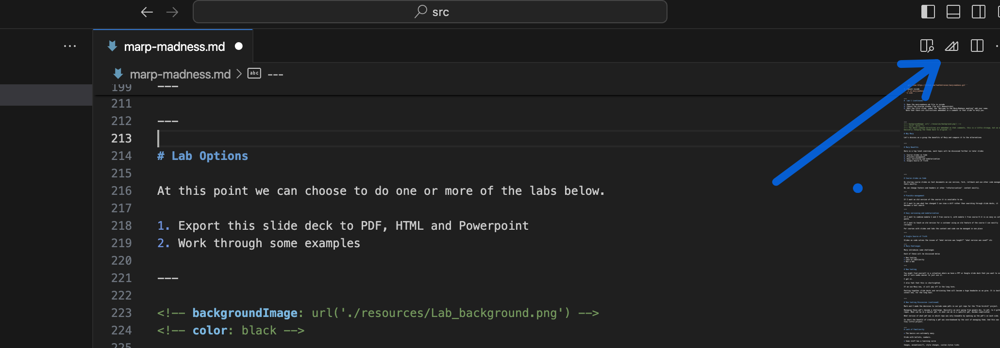
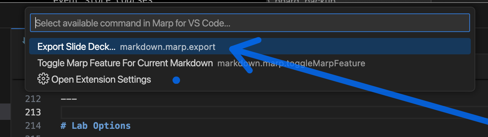

<!-- color: white -->
<!-- The color directive will be inherited
Probably need to learn how to set it globally and override it
locally
 -->
# Marp-Madness

Welcome to the Marp-Madness meeting.

<!-- add your name here 
This is an html style comment
html tags are for the most part supported by 
marp. Add a line like the one below to modify the slide 
to show your name as a second level header
you can simply copy and paste the line to outside the comment block
## My name is xxxx
-->


---
<!-- paginate: true -->
<!-- paginate adds slide numbers, we start on the second -->
# Agenda

* Getting Started
  * Clone Repo
  * Launch VScode
* Why Marp
  * Contrast with alternatives
* Building content
   * Content management

---

# Getting Started

Before we get into the weeds, let's modify some content!! 

In the following slides you will find instructions on how to modify the first slide of this presentation. 

It will be so awesome, really. 

---
<!-- Note we change backgrounds here, I think in classes we will have separate lab instructions, but since marp is the lab here, just demonstrating -->
<!-- backgroundImage: url('./resources/Lab_background.png') -->
<!-- color: black -->
# Lab 1

## Your first Step on the road to Marp-Madness

Please compete the following steps
1. Clone this repo to your local machine

``` git clone https://github.com/tomthetrainer/marp-madness.git```

2. Launch vscode
``` $ cd marp-madness```
```$ code . ```


---
#  Lab 1 (continued)

3. Open the marp-madness.md file in vscode
4. Launch the preview window (Tom will demonstrate)
5. Edit the first slide, under the "Welcome to the Marp-Madness meeting" add your name.
  Note that there are instructions embedded in a comment in that slide to help you.


---
<!-- backgroundImage: url('./resources/background.png') -->
<!-- color: white -->
<!-- The above command directives are embedded as html comments, this is a little strange, but we are basically changing the theme back to original -->

# Why Marp

Let's discuss as a group the benefits of Marp and compare it to the alternatives


---

# Marp Benefits

Here is a top level overview, each topic will be discussed further in later slides

1. Course slides as Code
2. Flexible management
3. Easy versioning and modularization
4. Single Source of Truth


---

# Course slides as Code

By storing course slides as text documents we can version, fork, rollback and use other code managent tools easilly.

We can change footers and headers or other "refactorization"  content easilly.

---

# Flexible management

If I want an old version of the course it is available to me.

If I want to see what has changed I can view a diff rather than searching through slide decks, it becomes a text search

---

# Easy versioning and modularization

If I want to combine module 1 and 2 from course A, with module 1 from course B it is as easy as cut and paste. 

If I want to teach an old version for a customer using an old feature of the course I can easilly rollback

For courses with slides and labs the content and code can be managed in one place

---

# Single Source of Truth

Slides as code solves the issues of "what version was taught?" "what version was used?" etc

---
# Marp Challenges

Marp introduces some challenges

Each of these will be discussed below

* New tooling
* Lack of familiarity
* Not a GUI 

---

# New tooling

You might find yourself in a situation where we have a PPT or Google slide deck that you want to use, and it sure seems easier to just use it. 

I get it.

I also feel that this is shortsighted. 

If we use Marp now, it will pay off in the long term. 

Pasting together slide decks and versioning them will become a huge headache as we grow. It is best to invest now, for the long haul.


---

# New tooling Discussion (continued)

Mark and I made the decision to include some pdfs in our git repo for the "From Scratch" project. 

Managing those pdf's became a challenge. Basically we were going from google doc, to pdf, to 4 github repos. What can be in a master pdf, vs what can me in a specific pdf, became complicated. 

What version of what pdf was in which repo was only knowable by opening up the pdf's on each side. 

In short the benefit of creating a pdf was overshadowed by the cost of managing them. And this was a tiny little project. 


---
# Lack of Familiarity

* The basics are extremely easy. 

Slide with bullets, numbers. 

* Some stuff has a learning curve

Images, animations(?), style changes, custom styles links


---

# Not a GUI tool

Style is done with CSS, html or markdown rather than drag and drop, point and click 

---
# Let's build some slide decks

There are a number of ways to take the markdown file to a pdf,ppt, html document

In this section we will review a few of them. 

Most likely our course management workflow will automate this build process, but for educational purposes lets review a few of them

1. VScode marp tools
2. command line tools


---

# Lab Options

At this point we can choose to do one or more of the labs below.

1. Export this slide deck to PDF, HTML and Powerpoint
2. Work through some examples

---

<!-- backgroundImage: url('./resources/Lab_background.png') -->
<!-- color: black -->

# Lab 1 :Export this slide deck

Follow the instructions below to export this slide deck to various formats

---

# Open Marp Tools




---

# Choose Export



---

# Lab Notes

Note that when I exported as html from VScode, I got an empty collection of pages


When I used the marp command line tool I had success

``` marp marp-madness.md ``` will produce an html file in the same directory as the file


---
# More ways to export

Marp provides a command line export, in order to use we need to specify the ```allow-local-files``` option

Here are some examples
Build course to pdf
``` marp --allow-local-files --pdf src/marp-madness.md -o build/marp-madness.pdf```
Build all courses in src to pdf in build
 ```marp --allow-local-files --pdf --input-dir src/ --output build/```


---

# Server Mode

This is interesting and potentially useful

Leaving here for reference

```marp --server --allow-local-files src```

---

# Congratulations !

You have exported a Marp Slide Deck

---

# Appendix

The remaining content I left in , in case anyone has questions about style options

My assumption is that at some point we would have a style guide with stuff like
* alignment for various slide types
* Copyright notice
* Color palette
* Fonts

For now I hope a base set of rules will suffice


---

<!-- Scoped style -->
<style scoped>
h1 {
  color: red;
  text-align: center;
}
</style>

# Red text centered (only in the current slide page)

Mostly this is here because inline styles seemed tricky, some took, some did not takes, so obviously there are parsing rules

---

# Back to normal

Assume this is left aligned

---

<!-- Scoped style -->
<style scoped>
h1 {
  color: red;
  text-align: center;
}
</style>

# Red text centered (only in the current slide page)
---

# Back  to Regular